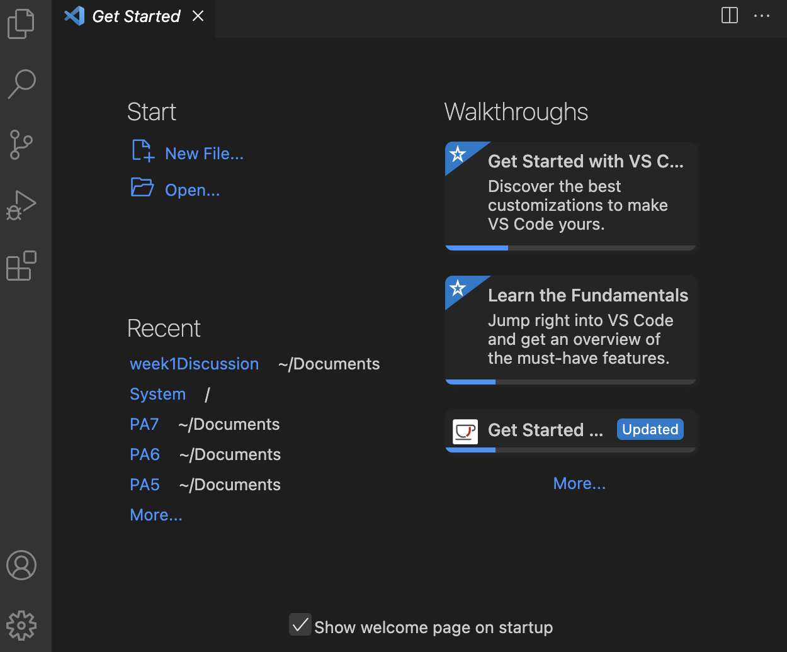
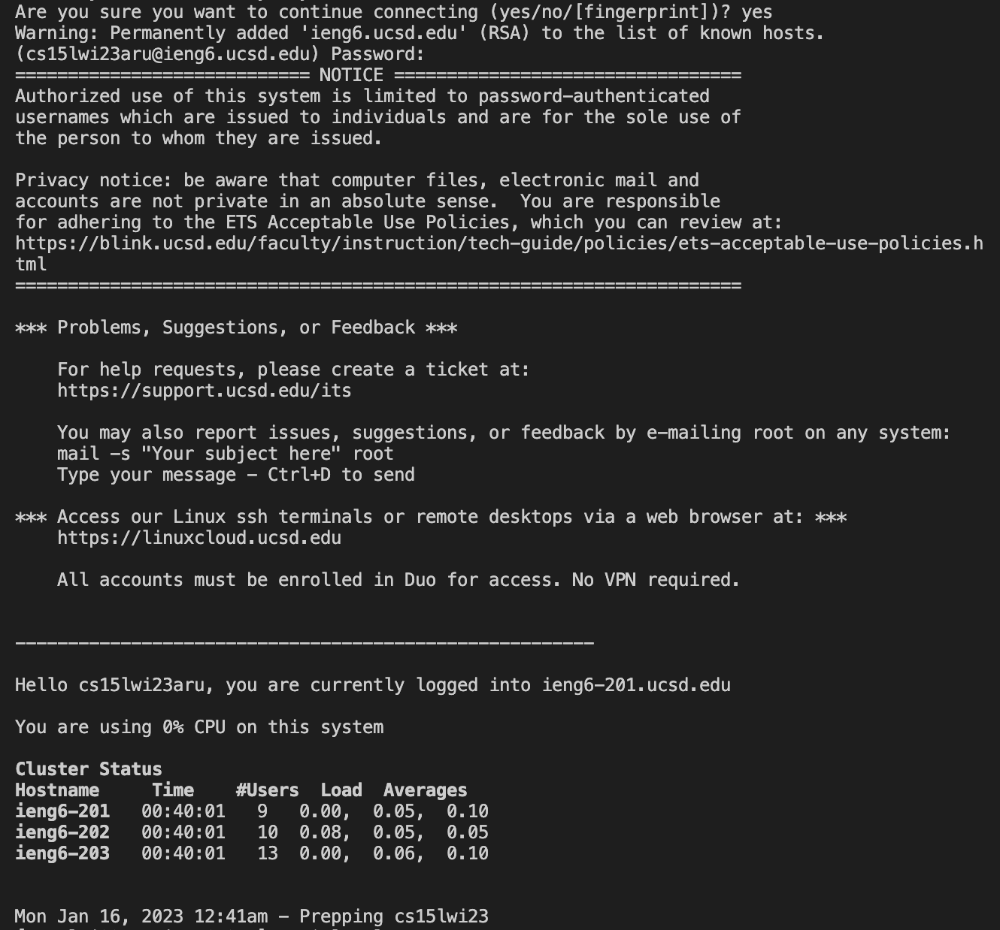

# Lab Report 1
Hi CSE 15L students! Here's a quick tutorial on how to log into a course-specific account on `ieng6`.
There are three main steps.
## 1. Installing VScode

1. Go to the Visual Studio Code [website](https://code.visualstudio.com/download).
2. Follow the instructions to download VSCode onto your computer.
3. Open VSCode. It should look similar to the screenshot below, although the color scheme or menu bar may differ.

## 2. Remotely Connecting
1. Search for your CSE 15L course-specific account [here](https://sdacs.ucsd.edu/~icc/index.php) and [reset your password](https://docs.google.com/document/d/1hs7CyQeh-MdUfM9uv99i8tqfneos6Y8bDU0uhn1wqho/edit). Resetting your password may take a few minutes to be in effect.

2. If you are working on a Windows computer, first downlaod [git for Windows](https://gitforwindows.org/) and  set the default terminal to use [git bash in VS Code](https://stackoverflow.com/a/50527994).
3. Open a new terminal in VS Code and run `$ ssh cs15lwi23zz@ieng6.ucsd.edu`. Replace the `zz` with your course-specific account.
4. You will be asked to confirm the connecting processing. Type `yes` and press enter.

5. After inputting your password, a successful remote connection should look similar to this.

## 3. Trying Some Commands
1. Run some commands on your own computer and the remote computer (after ssh-ing).
- You can log out of the remote computer by running `exit` or CTRL-D.
2. Confirm that the outputs are as expected.
- Running `ls -a` should list out all directories and files as such.

- Running `cat /home/linux/ieng6/cs15lwi23/public/hello.txt` should concatenate multiple files and output a greeting message.

