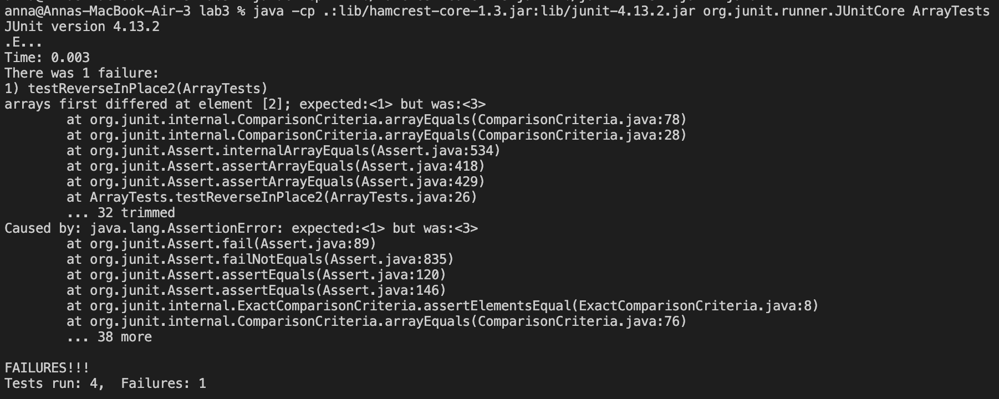

# Lab Report 2
Here is a report covering the labs from week 2 and week 3!

## Part 1
Here is a web server called `StringServer`. This server keeps track of a single string that gets added to by incoming requests. The input comes from the user-inputted URL. 
The requests look like `/add-message?s=<string>`. Whatever string is inputted after the `=` will be concatenated to the existing strings, along with a new line (`\n`). The web page should display the entire history of strings inputted.

Here is the code for `StringServer`:


Here is an example of successfully concatenating a string using `StringServer`.

In order for the String `"how are you"` to be concatenated to the existing string of `"hello"` and be displayed on the webpage, the method `handleRequest(URI url)` is called. Relevant arguments for this method include the URI object, which is `http://localhost:4000/add-message?s=how are you` in this case. This goes through the method and gets split up into relevant Strings. In lines 13-21 of `StringServer`, the url gets split up and the value of the string gets concatenated to the existing string in line 17. In this scenario, `how are you\n` gets concatenated to `hello`. This causes the value of `msg`, the variable storing all the string requests, to update to store `hello\n how are you\n`. Therefore, when `msg` is returned at the end of the method, the webpage displays both the current stsing request and any previoius requests.

Here is an example of unsuccessfully concatenating a string on `StringServer`, resulting in a 404 error.

In this screenshot, the method `handleRequest(URI url)` is called. Relevant arguments for this method include the URI object, which is `http://localhost:4000:add-messge?s=123` in this case. This goes through the method and gets split up into relevant strings. In lines 13-21 of `StringServer`, the url gets split up and into relevant values. On line 14, the code checks if `add-message` is in the url. Because of the typo in the url, `add-message` is not in the url, and the else block finishes. It reaches the end of the method and `404 Not Found!` gets returned at line 22. Because the url did not contain `add-message`, the value of `msg` does not change from this request. The value of `msg` only changes if the url is in the format `/add-message?s=<string>`.

## Part 2
Here is the method `reverseInPlace(int[] arr)` in `ArrayExamples.java`.


A failure-inducing input for this method is `int[] input2 = {1,2,3}`.
Here is the JUnit test for this failure-inducing input:
```
@Test
public void testReverseInPlace2(){
  int[] input2 = {1,2,3};
  ArrayExamples.reverseInPlace(input2);
  assertArrayEquals(new int[]{3,2,1}, input2);
}
```

An input that does not induce a failure is `int[] input = {5}`. 
Here is the JUnit test for this input:
```
@Test
public void testReverseInPlace(){
  int[] input1 = {5};
  ArrayExamples.reverseInPlace(input1);
  assertArrayEquals(new int[]{5}, input1);
}
```
Running the JUnit tests convey that the symptom of the failure-inducing input is `{3,2,3}`. The JUnit test displays an error message for running `testReverseInPlace2()`, stating that the expected array and the actual array were different. Because this was the only test that failed, it means that `testReverseInPlace()` passed and the expected array matched with the actual outputted array.


