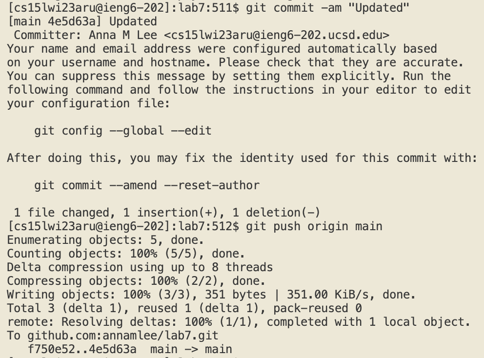

# Lab Report 4
Here is a report covering the exact keys pressed needed to execute each numbered step after the timer starts in the week 7 lab competition. 

## 4. Log into ieng6
Keys pressed: `ssh cs15lwi23aru@ieng6.ucsd.edu<enter>`

I logged into ieng6 by `ssh`-ing into my account. I did not need to type in a password for my `ieng6 ` account because I had previously generated an SSH key for `ieng`. This helped to speed up the process.

## 5. Clone the fork of the Github repository
Keys pressed: `git clone "<Command-V>"<enter>`, `cd l<tab><enter>`

The SSH link to the Github lab7 repository was already copied from the Github website, so I used the `<Command-V>` keyboard shortcut to paste it into terminal. I then changed directories to lab7, utilizing the the tab button to autocomplete its name.

## 6. Run the tests demonstrating a fail
Keys pressed: `<Command-V><enter>`, `<Command-V> L<tab>T<tab><delete><enter>`

The `javac -cp .:lib/hamcrest-core-1.3.jar:lib/junit-4.13.2.jar *.java` command was copied over from the course website, so I used the `<Command-V>` keyboard shortcut to paste it into the terminal. I then copied the `java -cp .:lib/hamcrest-core-1.3.jar:lib/junit-4.13.2.jar org.junit.runner.JUnitCore` command from the coruse website and once again used the `<Command-V>` shortcut to paste it. `L<tab>T<tab><delete>` was used to autocomplete the name of the tester file, ListExamplesTests, and the `<delete>` was necessary to delete the `.` that was added to the autocomplete.

## 7. Edit the code to fix the bug
Keys pressed: `vi +43 L<tab>.<tab><enter>`, `lllllli<delete>2`, `<esc>:wq<enter>`

I opened the file ListExamples.java in vim with the help of the `<tab>` autocomplete and went straight to the line causing the error, line 43, with the `+43` command. I then held the letter `l` to move the cursor to the left until it went to the error location and went into editing mode with the command `i`. I fixed the error by changing index1 to index2 in line 43. I then saved and exited the file with `<esc>:wq<enter>`.

## 8. Run the tests demonstrating success
Keys pressed: `<up><up><up><enter>`, `<up><up><up><enter>`

The `javac -cp .:lib/hamcrest-core-1.3.jar:lib/junit-4.13.2.jar *.java` command was 3 up in the terminal history, so I used the up arrow to access it. Then the `java -cp .:lib/hamcrest-core-1.3.jar:lib/junit-4.13.2.jar org.junit.runner.JUnitCore` command was also 3 up in the terminal history, so I accessed and ran it in the same way.

## 9. Commit & push the changes to Github
Keys pressed: `git commit -am "Updated"<enter>`, `git push origin main<enter>`

I committed the changes with a commit message of "Updated" to show that the bug was fixed. I then pushed the changes to my Github account. I didn't need to type in my Github username or password to push the changes because I had previously created an SSH key GitHub already.
